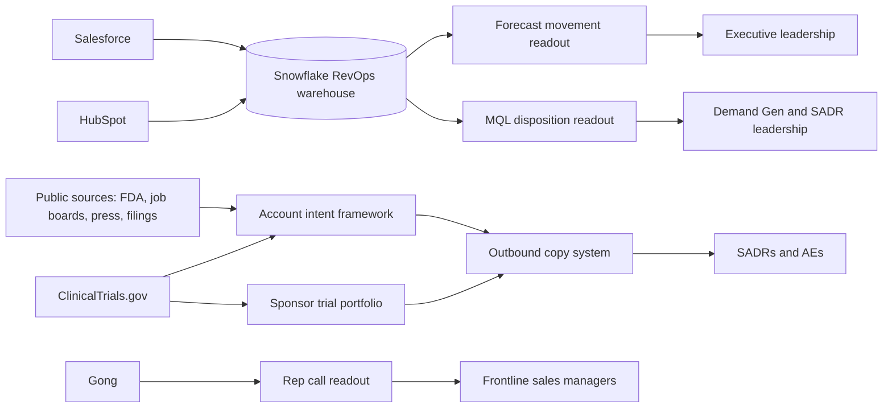

# AI-Driven GTM Systems

Context files for the AI work on my resume. Each file expands one resume bullet: the problem, what was built, the data it draws on, how it works, the controls that make it trustworthy, and the measured impact.

Built in 2026 as VP of Revenue Operations & Outbound Sales at Florence Healthcare, a clinical trial software company selling to pharma sponsors, CROs, and research sites.

## Index

| # | Resume bullet | File |
|---|---|---|
| 1 | Executive reporting system (forecast, MQL, and rep call readouts) | [01-executive-reporting-system.md](01-executive-reporting-system.md) |
| 2 | Account intent framework (8 public buying-signal criteria) | [02-account-intent-framework.md](02-account-intent-framework.md) |
| 3 | MQL disposition readout | [03-mql-disposition-readout.md](03-mql-disposition-readout.md) |
| 4 | Outbound copy system | [04-outbound-copy-system.md](04-outbound-copy-system.md) |
| 5 | GTM skill library for SADR and AE teams | [05-gtm-skill-library.md](05-gtm-skill-library.md) |

Supporting detail for individual skills:

| Topic | File |
|---|---|
| Forecast movement readout | [supporting/forecast-movement-readout.md](supporting/forecast-movement-readout.md) |
| Rep call readout and the Gong attendee artifact | [supporting/rep-call-readout.md](supporting/rep-call-readout.md) |
| CRM integrity guardrails | [supporting/crm-integrity-guardrails.md](supporting/crm-integrity-guardrails.md) |
| Sponsor trial portfolio research | [supporting/sponsor-trial-portfolio.md](supporting/sponsor-trial-portfolio.md) |
| Executive communications toolkit | [supporting/executive-communications.md](supporting/executive-communications.md) |

## How the pieces connect

Two loops run through the system. The reporting loop turns warehouse data into weekly decisions for leadership. The prospecting loop turns public signals into prioritized accounts and then into outreach, with each skill handing its output to the next (the intent framework passes a buyer persona tag to the outbound system, and the portfolio research supplies the trial footprint the outbound copy is grounded in).

## Stack

Claude Skills (packaged `SKILL.md` files with reference documents and Python scripts), Claude Cowork, scheduled tasks, hosted artifacts, and Claude in Chrome for browser automation. MCP connectors for Snowflake, Salesforce, Gong, Slack, and ClinicalTrials.gov. SQL against dbt-modeled marts in Snowflake. Python with openpyxl for Excel output and Playwright for PDF rendering. Clay for enrichment routing where public pages cannot be fetched directly.

**Attribution.** The reporting skills query Snowflake through a shared analyst skill maintained by Florence's data team. That layer (connection handling, schema map, documented query traps) is their work. The systems in this repo are built on top of it.

## Design principles

Five principles recur across every system here.

1. **Validate before codifying.** Every criterion and query was tested against live accounts and real data before it became a skill. Two intent criteria were shelved because no reliable public source existed.
2. **Keep one source of truth.** Criteria definitions, exclusion lists, and house style each live in one reference file. Orchestrators read those files directly, so logic cannot drift between copies.
3. **Reconcile before publishing.** Reports carry hard reconciliation gates. If deal-level detail fails to sum to category totals, or MQL counts disagree across sources, the run stops.
4. **State what the data cannot say.** Outputs separate "not found" from "could not check," carry explicit confidence levels, and label small samples.
5. **Write for the decision.** Every readout leads with a verdict, ties findings to an owner, and ends with actions.
